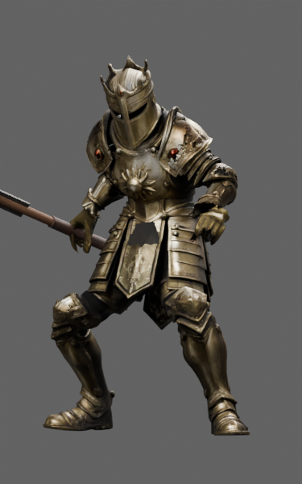
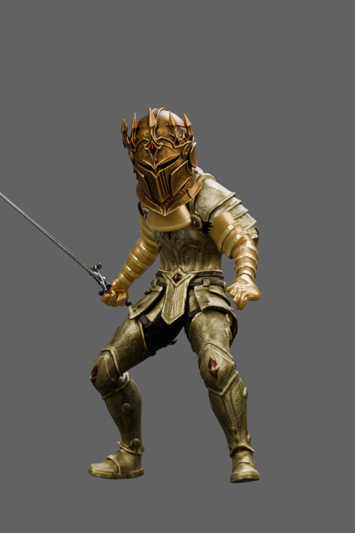
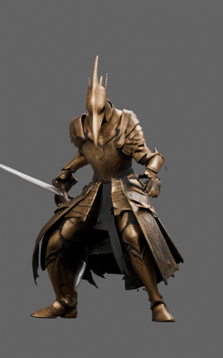

# Frankendom Characters

Character design → TRELLIS reconstruction → Blender fitting → verified review assets.

**Five characters, 45 selected L2–L10 models. This is the character-making project, not the Frankendom game.** It contains the workflow, source recipes, previews, hashes and public downloads needed for another artist or assistant to continue the work.

## Start here

- **[30-point GPT web handover](docs/GPT-WEB-HANDOVER.md)** — copy/paste this into your new task.
- **[Cloud workflow](docs/CLOUD_WORKFLOW.md)** — Hugging Face, TRELLIS.2, bounded cloud Blender and recovery.
- **[Character skill](skills/frankendom-character-pilot/SKILL.md)** and [troubleshooting](skills/frankendom-character-pilot/references/export-and-cloth-troubleshooting.md) — includes the Witch lessons.
- **[Full model/source downloads](https://github.com/DomLynch/Frankendom-Chars/releases/tag/v0.1.0-candidates)** and [machine-readable hashes](catalog.json).

Git contains text recipes, evidence summaries and actual-model previews. The six large archives live in GitHub Releases (about 2.1 GB total), keeping normal clones lightweight and avoiding a Git LFS requirement. The green “Code → Download ZIP” archive contains the repository, **not** those asset downloads. No private Hugging Face access is required to download the published packs.

## Selected characters and honest status

| Character | Delivery status | Known visual limitations |
|---|---|---|
| [Witch](characters/witch/README.md) | L10 separate asset complete; other ranks review candidates. | L4/L5 donor face fragments and coarse inner face framing remain. Rear green hood overlap is repaired. |
| [Knight](characters/knight/README.md) | Nine fitted candidates; selected warm L2 and repaired L6/L7. | Soft shoulder/elbow detail, cuff transitions, low-detail source hands and L6 shoulder scuff remain. |
| [Dwarf](characters/dwarf/README.md) | Targeted closed-helmet/local-coverage revision; nine candidates. | Pale L9 underarm patch, inherited finger deformation, plate seams and localized old-armour stretch remain. |
| [Nightborn](characters/nightborn/README.md) | Corrected closed elite helmets and covered limbs; lower ranks preserved. | Coarse original lower-rank face/hair, simpler arm shells and rough plate/joint transitions remain. |
| [Plague Doctor](characters/plaguedoctor/README.md) | Nine animation-restored candidates, including gold crowned-beak L10. | Rough/open coat hems, subdued materials, ruby readability and glove/cuff/shoulder transitions remain. |

Witch L10 is complete as a separate fitted asset. The other entries are review candidates with the listed limitations; none is claimed production-ready or installed in the game. All retain their recorded original rigs, weapons and animation data. See each handoff for exact preservation checks and inherited format defects.

## Actual L10 exports

<a href="characters/witch/README.md"></a>
<a href="characters/knight/README.md"></a>
<a href="characters/dwarf/README.md"></a>
<a href="characters/nightborn/README.md"></a>
<a href="characters/plaguedoctor/README.md"></a>

These are model renders, not generated concept images. The archives include the wider view/action evidence and the original references separately.

## Download one complete case

```bash
git clone https://github.com/DomLynch/Frankendom-Chars.git
cd Frankendom-Chars
python3 scripts/fetch_assets.py witch --output work/witch
```

Requires Python 3.11+. The downloader checks release and model SHA256 values, rejects unsafe archive paths and preserves non-empty output directories. Choose `witch`, `nightborn`, `knight`, `dwarf` or `plaguedoctor`. Witch automatically downloads both review and source bundles. Full assets are also available directly from the release page.

## Build principles

Keep original inputs immutable. Prove one pilot for each materially different assembly method. Preserve exact animation timing and bind compatibility, not only clip names. Use saved donors for repairs. Give L8–L10 different closed headgear where the character brief requires it, and inspect full limb coverage in exported poses. Match every final capture to its model hash. Document remaining defects before handing off.

The palette progresses from brown leather → bone/hide → copper → bronze → iron → steel → blackened steel/ruby → emerald → full gold. Changes should alter construction and silhouette as well as material. Source body proportions and character identity remain protected.

## Repository map

- `characters/<id>/` — selected-model metadata, actual previews, dated recipes and receipts.
- `skills/frankendom-character-pilot/` — reusable fitting and review guidance.
- `docs/` — handover, cloud workflow and provenance.
- `examples/submit_witch_review.py` — explicit, bounded paid-job example for reviewing an existing model; not run by CI.
- `scripts/` — free local download/integrity tooling.
- GitHub Releases — full selected GLBs, originals, donors, scenes and review packages.

Historical recipes are character-specific and may contain old local paths or private dataset names. They are not a universal one-command character generator. The cloud example uses your own private destination and secret-managed authentication. It was extracted from the successful workflow but was not rerun as a paid job during publication.

## Verification

```bash
python3 scripts/verify_repository.py
python3 -m unittest discover -s tests -v
```

CI runs these commands without cloud credentials or paid calls. Publication validation checked all 45 model hashes against their selected deliveries, six ZIP integrity checks, preview/model receipts and credential signatures. It does not replace the recorded model/animation checks or artistic review. [Provenance and limits](docs/PROVENANCE.md) · [Current state](PROJECT_STATE.md).

No game code, game deployment, account secrets or runtime integration are included. Continuous collision clearance, equipment-slot/finisher integration and real-phone performance remain separate work. No blanket licence is newly assigned to character assets; preserve original provenance and upstream tool notices.
