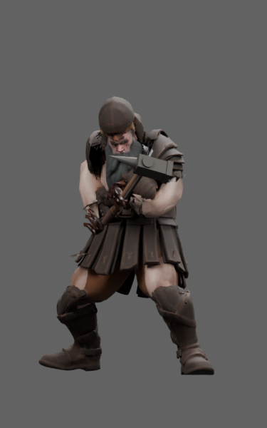
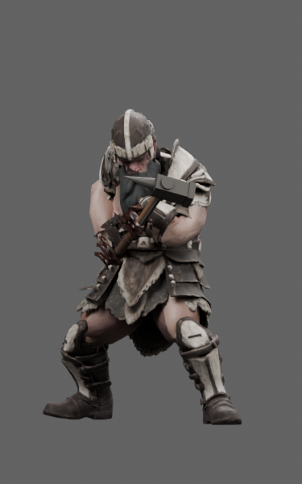
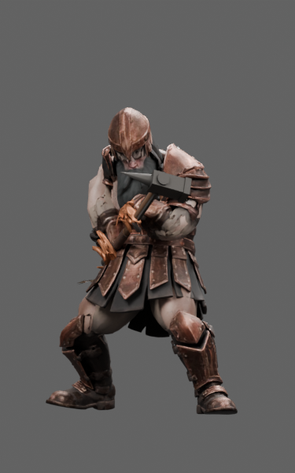
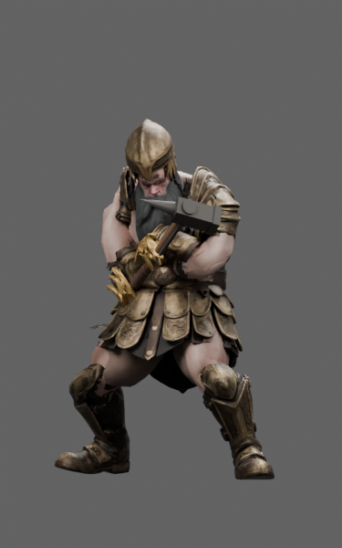
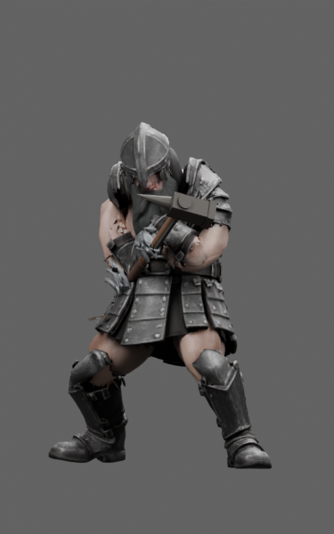
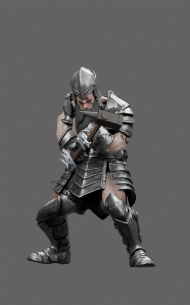
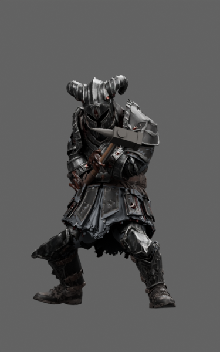
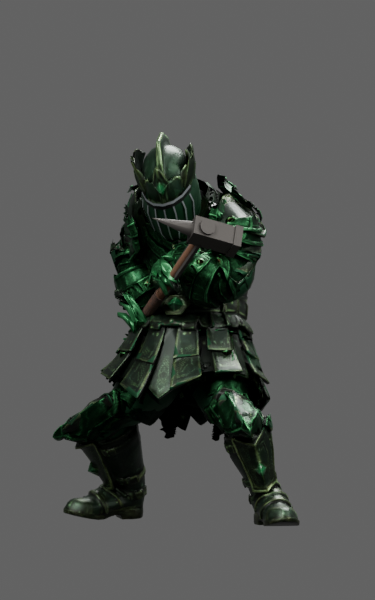
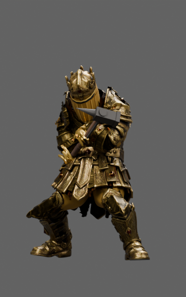

# Dwarf · L2–L10

Targeted closed-helmet/local-coverage revision; nine candidates.

**Remaining defects:** Pale L9 underarm patch, inherited finger deformation, plate seams and localized old-armour stretch remain.

**Recorded format result:** 88 inherited quaternion errors; no new errors.

[Download full asset/source package](https://github.com/DomLynch/Frankendom-Chars/releases/download/v0.1.0-candidates/dwarf-L2-L10-helmet-coverage-candidates.zip) · [Selected model manifest](manifest.json) · [Historical handoff](case/README.md)

These are separate fitted review assets. No game installation, six-slot carrier/finisher integration, continuous contact clearance or physical-phone performance is claimed. The full archive contains GLBs, original inputs, donors, fitting scenes, scripts and exact-model studio evidence. Earlier scenes can precede mandatory repair steps.

The `case/` directory preserves historical recipes and receipts verbatim. Its relative asset links resolve in the full downloaded archive; local paths/private dataset names in old scripts must be adapted before use. Follow the [cloud workflow](../../docs/CLOUD_WORKFLOW.md).

| Rank | Actual exported model | Size | Joints / clips | SHA256 |
|---|---|---:|---:|---|
| L2 |  | 22.1 MB | 65 / 37 | `cafc5257ed12b9545875aa6a52e19ef22ebac659b48da3fb99dbc7218070f9ff` |
| L3 |  | 22.7 MB | 65 / 37 | `16785b04b038ab5fa6d6ff64c72dcf5ed6e688a9c43c7c6a78b2ef6709d3912f` |
| L4 |  | 21.8 MB | 65 / 37 | `6ac8fd8ca6b6b10d1169b023a8436c796ff6aa06908ac375c4e5a3156c2d2c43` |
| L5 |  | 23.1 MB | 65 / 37 | `ee016eae352b08e9bb72d9d3028c39333d9d1718cac49aed782daa08aacd2d2c` |
| L6 |  | 22.2 MB | 65 / 37 | `d28ffc0ad10224cd29079f3ff031e6fe80887c1c8ac15941845f305b190ddc3b` |
| L7 |  | 21.5 MB | 65 / 37 | `afd2962ebab4a12f4d6a3dfdb77df61fc383a36152b627b138b66fa1b51e711b` |
| L8 |  | 79.1 MB | 65 / 37 | `8a2244b715baf50b016b75e54cc033fa50e11460ff145af1bfcdeaf4bf05f313` |
| L9 |  | 54.7 MB | 65 / 37 | `bf6385f3a5d4d2d42b222cc5fc997be39b45a54b1c87386fac78a7bf614b1fe5` |
| L10 |  | 52.7 MB | 65 / 37 | `cbdd1e5d5755061dbbab0535f55514266d9f9fd63601a02b10c5ecf886858965` |

## Elite silhouettes

