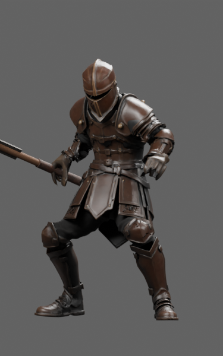
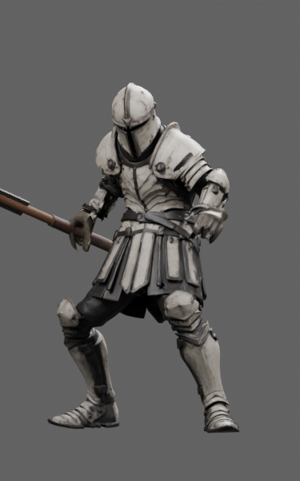
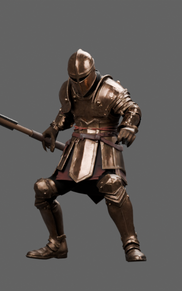
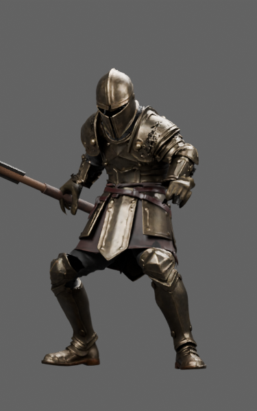
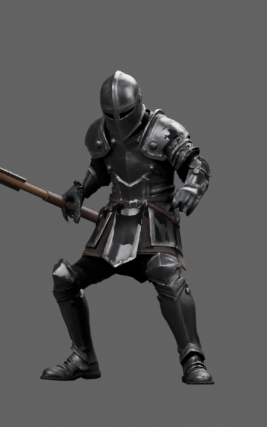
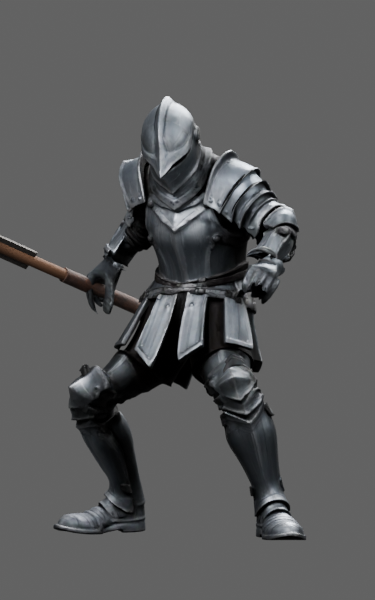
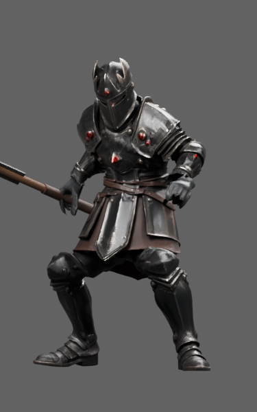
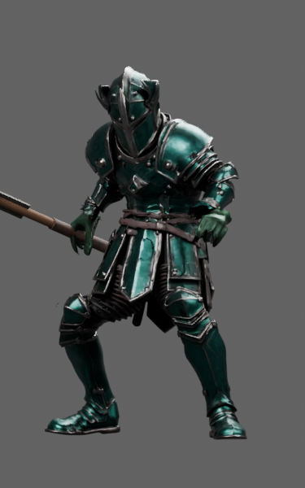

# Knight · L2–L10

Nine fitted candidates; selected warm L2 and repaired L6/L7.

**Remaining defects:** Soft shoulder/elbow detail, cuff transitions, low-detail source hands and L6 shoulder scuff remain.

**Recorded format result:** 95 inherited quaternion errors; no new errors.

[Download full asset/source package](https://github.com/DomLynch/Frankendom-Chars/releases/download/v0.1.0-candidates/knight-L2-L10-candidates.zip) · [Selected model manifest](manifest.json) · [Historical handoff](case/HANDOFF.md)

These are separate fitted review assets. No game installation, six-slot carrier/finisher integration, continuous contact clearance or physical-phone performance is claimed. The full archive contains GLBs, original inputs, donors, fitting scenes, scripts and exact-model studio evidence. Earlier scenes can precede mandatory repair steps.

The `case/` directory preserves historical recipes and receipts verbatim. Its relative asset links resolve in the full downloaded archive; local paths/private dataset names in old scripts must be adapted before use. Follow the [cloud workflow](../../docs/CLOUD_WORKFLOW.md).

| Rank | Actual exported model | Size | Joints / clips | SHA256 |
|---|---|---:|---:|---|
| L2 |  | 36.6 MB | 65 / 37 | `53c8ddf92dadd0f518e3552c5376b6974f6e2d1fc1b0dd87eac7a71717512be4` |
| L3 |  | 34.0 MB | 65 / 37 | `14c45faa80fdc924404daa9e103d9a22dad1b28d29f0e8d6ecf5d4dbfca8908c` |
| L4 |  | 30.4 MB | 65 / 37 | `331ed177f0efeaa8c5fcecc9b497f371c5ba1044b34264b54c0e9c9c5e2e6766` |
| L5 |  | 32.2 MB | 65 / 37 | `37751d989e74a2299436a1bd84a0e04823a5a5b01c770aae797657f82f233709` |
| L6 |  | 30.1 MB | 65 / 37 | `d56485a5e844077880d8f31c90d2ce5f0b69c38c024079fbb57d3d6e70c014db` |
| L7 |  | 25.4 MB | 65 / 37 | `82db420e9585a1e2d1c361d17f2e7c802de2f97f206d617c5da6da06309402b7` |
| L8 |  | 27.7 MB | 65 / 37 | `8e729c71ec36abbbe96ee77503bb55e6a0374757c52c9b4291cdea91960af908` |
| L9 |  | 32.5 MB | 65 / 37 | `2b8b52706d78182735e8eec883df1b5d0434ecceacad80ec2aafe12e622eed29` |
| L10 |  | 33.0 MB | 65 / 37 | `8668acfb7e7c660562b15207df813d1fd62ecc2153321570653d74a6d5b4d940` |

## Elite silhouettes

