# Nightborn · L2–L10

Corrected closed elite helmets and covered limbs; lower ranks preserved.

**Remaining defects:** Coarse original lower-rank face/hair, simpler arm shells and rough plate/joint transitions remain.

**Recorded format result:** 0 errors; 11–16 reported warnings per model.

[Download full asset/source package](https://github.com/DomLynch/Frankendom-Chars/releases/download/v0.1.0-candidates/nightborn-L2-L10-covered-review.zip) · [Selected model manifest](manifest.json) · [Historical handoff](case/HANDOFF.md)

These are separate fitted review assets. No game installation, six-slot carrier/finisher integration, continuous contact clearance or physical-phone performance is claimed. The full archive contains GLBs, original inputs, donors, fitting scenes, scripts and exact-model studio evidence. Earlier scenes can precede mandatory repair steps.

The `case/` directory preserves historical recipes and receipts verbatim. Its relative asset links resolve in the full downloaded archive; local paths/private dataset names in old scripts must be adapted before use. Follow the [cloud workflow](../../docs/CLOUD_WORKFLOW.md).

| Rank | Actual exported model | Size | Joints / clips | SHA256 |
|---|---|---:|---:|---|
| L2 | 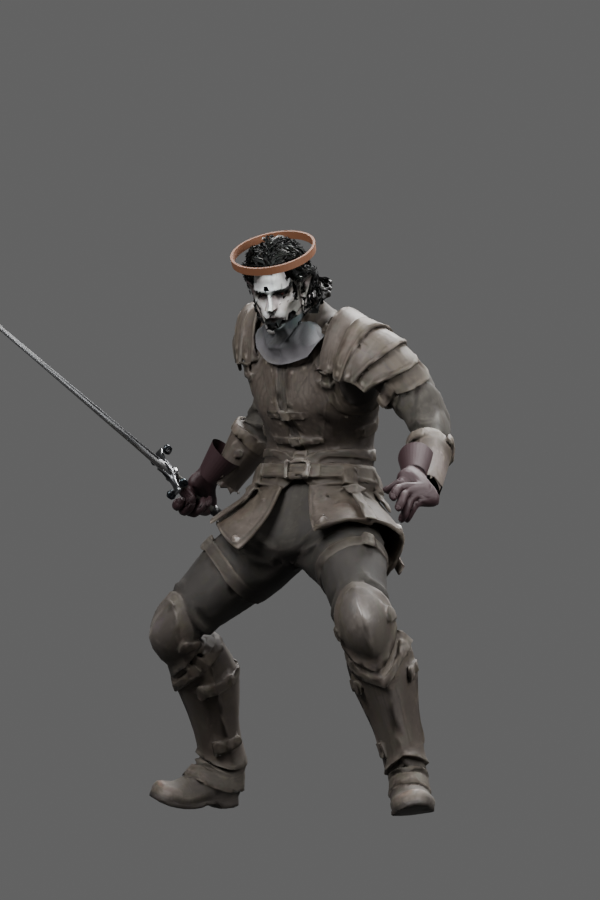 | 15.9 MB | 65 / 25 | `cb6c5b13af8b2bef6f14af6580359d5966d4babf0e6aa2418e783f3088920903` |
| L3 | 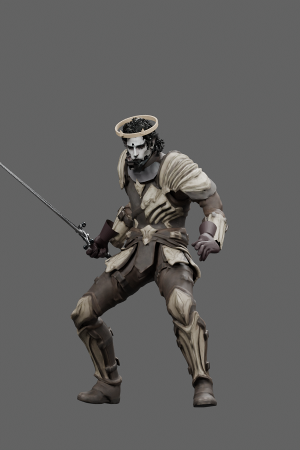 | 15.1 MB | 65 / 25 | `156f632d1088abf1406607613a029b1368eaa4ba94bbea751fd6e2141df42708` |
| L4 | 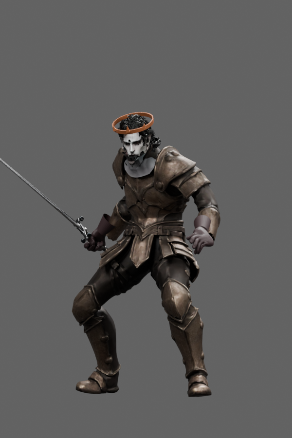 | 13.9 MB | 65 / 25 | `4c4aaa94f6db632a681af481b2ec8236239d9d38d2d603f1d38cce8469fb48a6` |
| L5 | 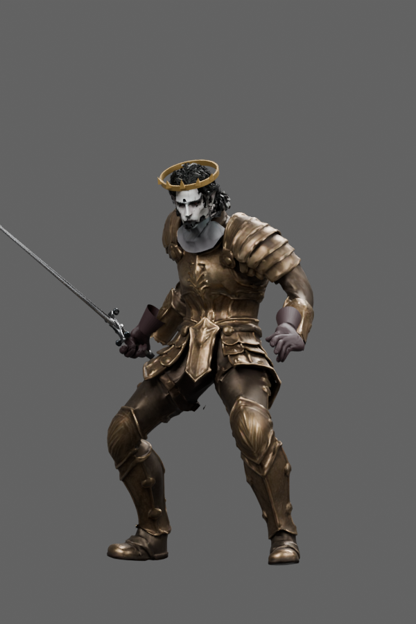 | 14.0 MB | 65 / 25 | `3140ef59a6dd05fd55f6ba7f9e0f0177805d987df6ee781c213659b6fb9a5818` |
| L6 | 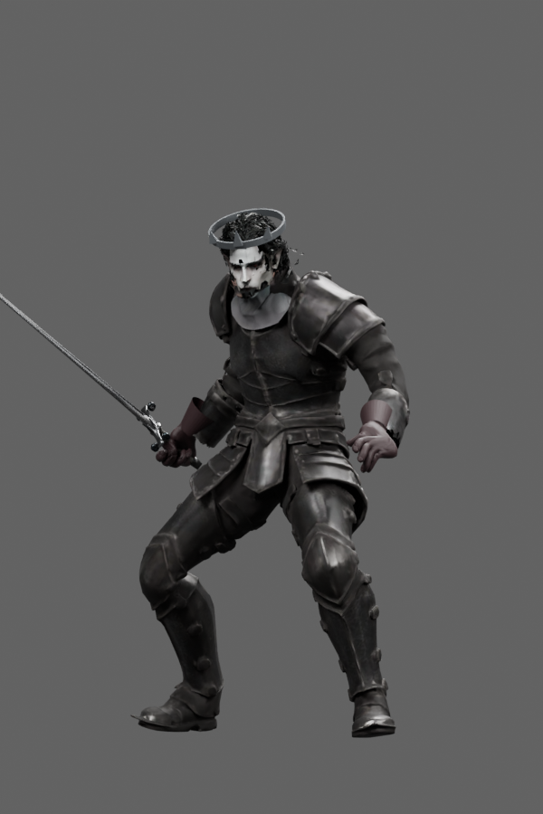 | 12.5 MB | 65 / 25 | `7a900f48d3727a383664fd936266f05e0b18822932e5073145477985e3b72a53` |
| L7 | 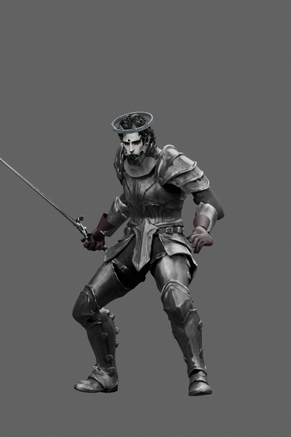 | 13.8 MB | 65 / 25 | `d29c6ad96777bb902d463b3442049b9841833fd4cd68c3402b0b53377a335d2e` |
| L8 | 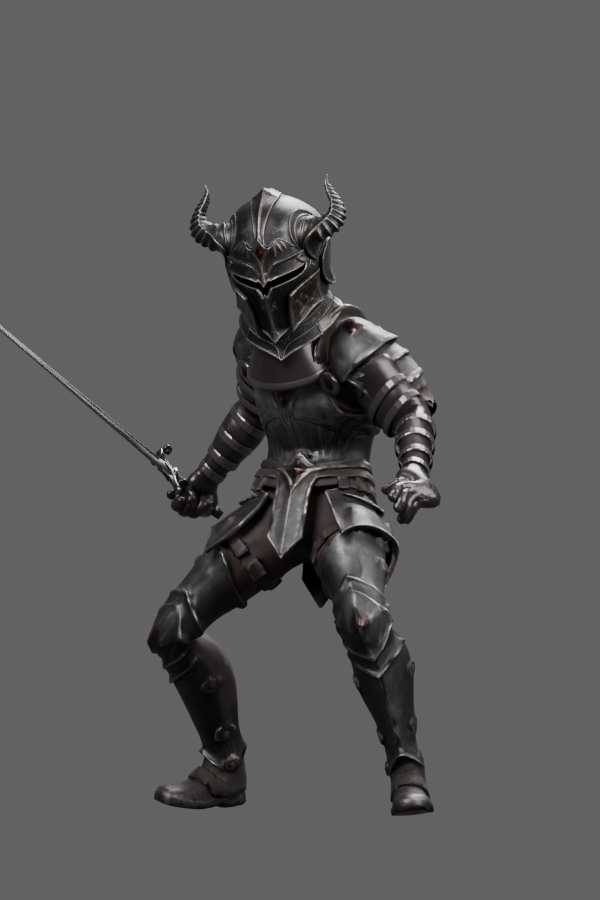 | 16.6 MB | 65 / 25 | `66edaf77cf0478efb76929d2500503b73723d45fef59a80c8fefd43ada231b14` |
| L9 | 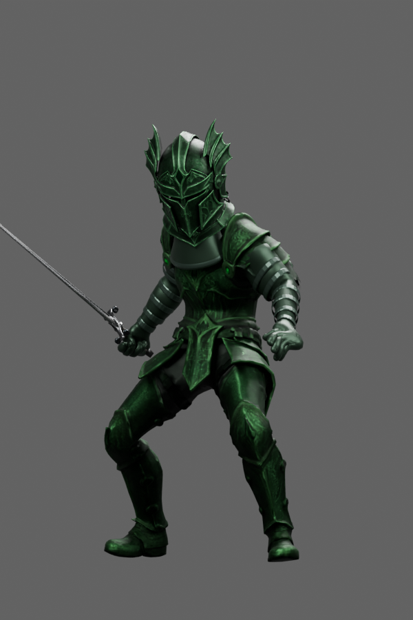 | 16.0 MB | 65 / 25 | `936df6880eeee7eedd03b7513eee496faca1bed1599645efb35518b278ad3ea1` |
| L10 |  | 16.2 MB | 65 / 25 | `4ce0d1b3fca7f44dc6f4d7706b2f448805263279c44941df1d62272b0020f110` |

## Elite silhouettes

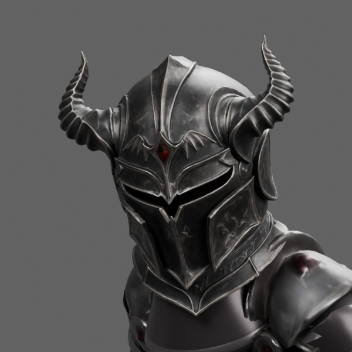
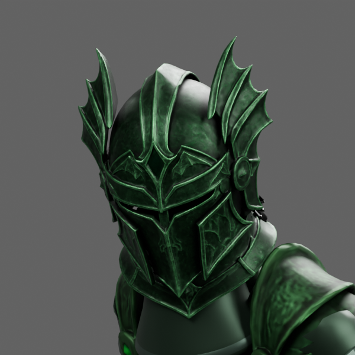
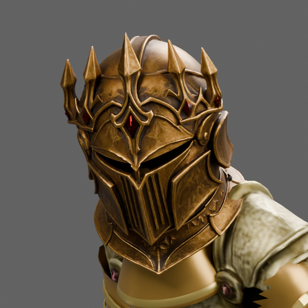
