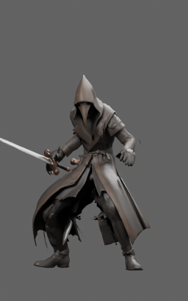
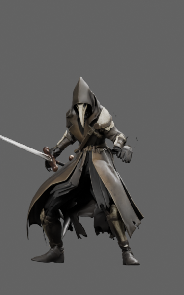
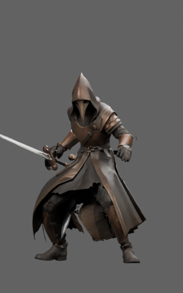
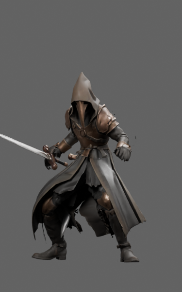
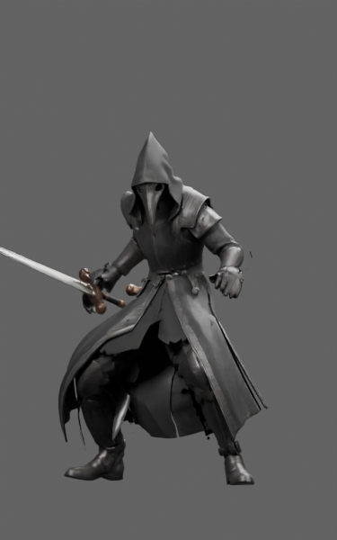
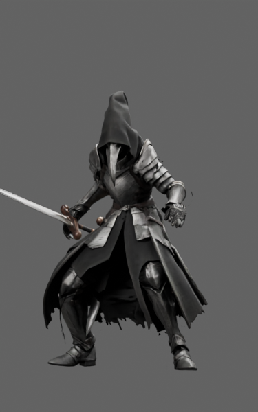
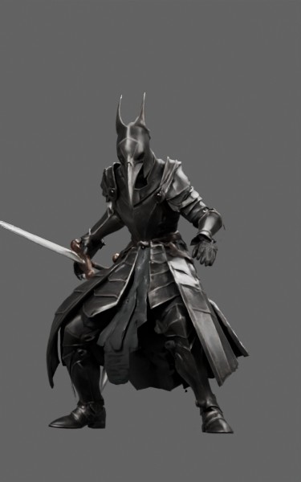
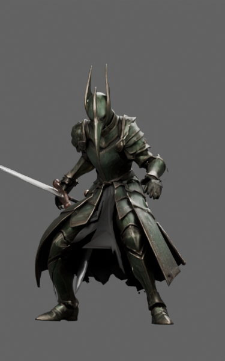

# Plague Doctor · L2–L10

Nine animation-restored candidates, including gold crowned-beak L10.

**Remaining defects:** Rough/open coat hems, subdued materials, ruby readability and glove/cuff/shoulder transitions remain.

**Recorded format result:** 0 errors; 3 reported hierarchy warnings per model.

[Download full asset/source package](https://github.com/DomLynch/Frankendom-Chars/releases/download/v0.1.0-candidates/plaguedoctor-L2-L10-review.zip) · [Selected model manifest](manifest.json) · [Historical handoff](case/HANDOFF.md)

These are separate fitted review assets. No game installation, six-slot carrier/finisher integration, continuous contact clearance or physical-phone performance is claimed. The full archive contains GLBs, original inputs, donors, fitting scenes, scripts and exact-model studio evidence. Earlier scenes can precede mandatory repair steps.

The `case/` directory preserves historical recipes and receipts verbatim. Its relative asset links resolve in the full downloaded archive; local paths/private dataset names in old scripts must be adapted before use. Follow the [cloud workflow](../../docs/CLOUD_WORKFLOW.md).

| Rank | Actual exported model | Size | Joints / clips | SHA256 |
|---|---|---:|---:|---|
| L2 |  | 13.7 MB | 65 / 25 | `a45a553e7cafbb1e5c53e517941923fd82b5eb366510946f5318fb4cc415755b` |
| L3 |  | 15.1 MB | 65 / 25 | `16f9803e79ce433d6dc20873b8b530b723a7dbf4420da5eb803d86636b5bdd96` |
| L4 |  | 12.5 MB | 65 / 25 | `438fe87506f7ec977638e659a87e8427ca297355c398c7a4f79f43d4d9fae46b` |
| L5 |  | 12.4 MB | 65 / 25 | `5eff8e71a0ebe46d7f1726d0866ad5f9b8bcbaf14c6fcc23125a4ddf2bd7f8e4` |
| L6 |  | 13.0 MB | 65 / 25 | `0c6ea065759b90dba837ad9ec6ddb1801f6d300510ece3d0f46b87b7cca45e96` |
| L7 |  | 12.7 MB | 65 / 25 | `c925171606ecc31b5f11eaf553d7546ab63b85a6a51cb87876dc909a4e35f2c4` |
| L8 |  | 13.2 MB | 65 / 25 | `8d5ebd8109a2a1154a403161d32e07fd286967a8eecd346c081a0d8c2816701c` |
| L9 |  | 13.4 MB | 65 / 25 | `7ae7001079d4c299aea6d42cff80ccf89b379c193c4e45be765be81f24230229` |
| L10 |  | 14.8 MB | 65 / 25 | `7e3563c4ff9b7bf69b563c49613dd3a7b583e1cdb92b298aae478c80c1863ff2` |

## Elite silhouettes

