# Witch · L2–L10

L10 separate asset complete; other ranks review candidates.

**Remaining defects:** L4/L5 donor face fragments and coarse inner face framing remain. Rear green hood overlap is repaired.

**Recorded format result:** 231 inherited errors; no new errors.

[Download full asset/source package](https://github.com/DomLynch/Frankendom-Chars/releases/download/v0.1.0-candidates/witch-ranks-review.zip) · [Selected model manifest](manifest.json) · [Historical handoff](case/HANDOFF.md)

[Download required Witch source bundle](https://github.com/DomLynch/Frankendom-Chars/releases/download/v0.1.0-candidates/witch-ranks-sources.zip) · [Final visual findings](case/FINAL-REVIEW.md)

These are separate fitted review assets. No game installation, six-slot carrier/finisher integration, continuous contact clearance or physical-phone performance is claimed. The full archive contains GLBs, original inputs, donors, fitting scenes, scripts and exact-model studio evidence. Earlier scenes can precede mandatory repair steps.

The `case/` directory preserves historical recipes and receipts verbatim. Its relative asset links resolve in the full downloaded archive; local paths/private dataset names in old scripts must be adapted before use. Follow the [cloud workflow](../../docs/CLOUD_WORKFLOW.md).

| Rank | Actual exported model | Size | Joints / clips | SHA256 |
|---|---|---:|---:|---|
| L2 | 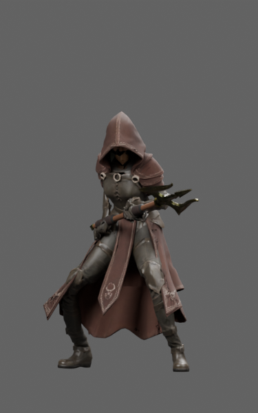 | 32.4 MB | 65 / 38 | `25ff099f94703a170cc406b2724cc2db8ab616ff23dadf72e51d69ccdd990ccb` |
| L3 | 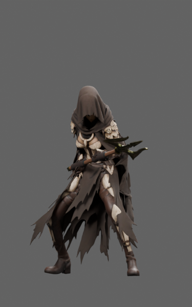 | 29.5 MB | 65 / 38 | `f35402f1afc9b15f152fa5ccc64b35a66d3065a6729e58dba1ed7edc22bc25d1` |
| L4 | 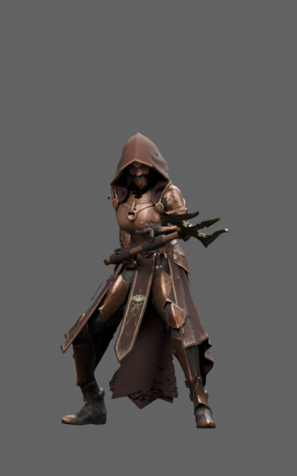 | 30.2 MB | 65 / 38 | `9911a9e645c493c12de518e5649819b828e09883f1d9c229999fde769c833661` |
| L5 | 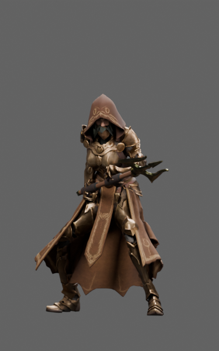 | 28.7 MB | 65 / 38 | `6464bf87f55f48aff185ea5c7d06c32b827ccbce21aee7b75918de3e4472d11d` |
| L6 | 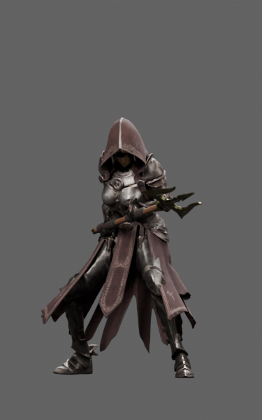 | 28.3 MB | 65 / 38 | `f097e3720a3bd3b671409f839fd4e7b50bf5118012f6c55e68f8a92e2f6b3fa1` |
| L7 | 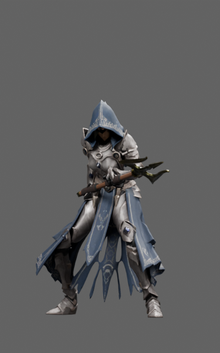 | 28.7 MB | 65 / 38 | `71d6f3aefcc4b62d06caac76728f5540648611a467811424fd887c639eaeca2d` |
| L8 | 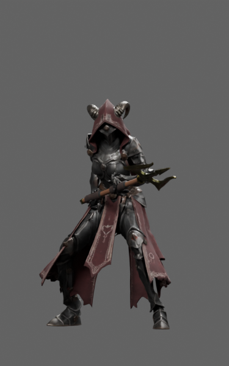 | 22.7 MB | 65 / 38 | `418457b2eb9af0e97a6504aab0ec7d23552d4046fd9b2db806ed452e2af6d68a` |
| L9 | 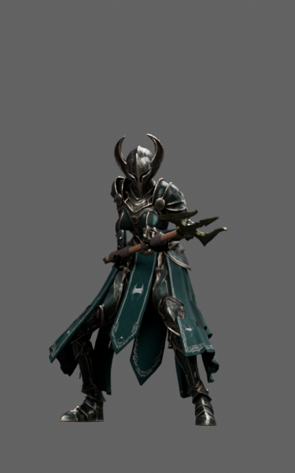 | 22.0 MB | 65 / 38 | `f8d3aa175c330146222a1ff61dd7fb3a1f777dc3084fbd623e410d62a487fc9a` |
| L10 | 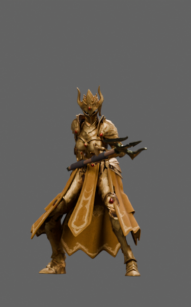 | 22.6 MB | 65 / 38 | `5e3325decf6c99af88a5a9e9277637b71d8921bf115842049b928c96dbdaaed7` |

## Elite silhouettes

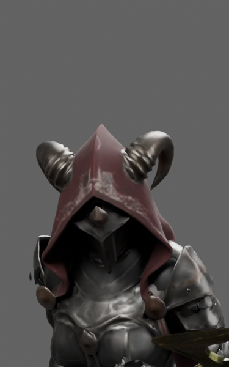
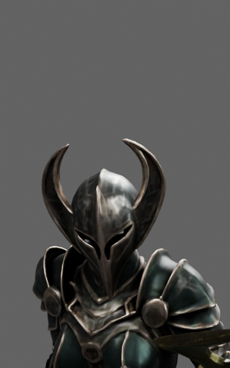
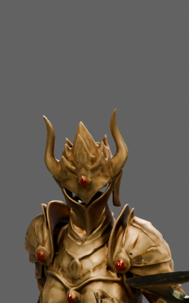
